# PharmaStock — Medicine Stock Management & Analytics Portal

Batch-aware pharmaceutical inventory portal built with React, Express, and MongoDB transactions for a Database Systems & Distributed Backend Development course project at **KL UNIVERSITY**.

| | |
|---|---|
| **Course** | Database Systems & Distributed Backend Development |
| **Institution** | KL UNIVERSITY |
| **Project Guide** | Dr. R. Sateesh Kumar |
| **Team** | KARKALA SHIVA REDDY (`2520030105`), PARIPALLI NAVADEEP (`2520030196`) |

---

## Problem statement

Pharmacy inventory is tracked in spreadsheets or flat tables, which cannot answer the questions that actually matter operationally: which lot expires first, what a batch is really worth after partial sales, which supplier is short-paid, and who changed a stock number without a paper trail. Selling stock without respecting batch expiry corrupts both safety compliance and margin reporting.

PharmaStock treats **the batch as the unit of truth**. Stock never changes directly; it changes only as the recorded result of a purchase, sale, refund, or adjustment. Every one of those is a MongoDB transaction, so a sale can never leave a negative batch, a broken allocation record, or an un-audited stock movement behind.

## Objectives

1. Model pharmaceutical inventory correctly around batches with expiry dates and per-batch cost.
2. Guarantee stock integrity under concurrent writes using MongoDB multi-document transactions.
3. Allocate outgoing stock by **FEFO** (First Expired, First Out) so near-expiry stock leaves first.
4. Enforce role-based access control at the API, not only in the UI.
5. Keep a complete, attributable audit trail of every mutation.
6. Expose operational, financial, and expiry insight through analytics and exportable reports.
7. Make every date boundary deterministic regardless of server time zone.

## Key features

- **Catalogue** — 34 seeded medicines across 10 categories with generic name, manufacturer, dosage, unit price, and reorder level.
- **Suppliers** — supplier records with purchase history, payment compliance, and supplied-medicine rollups.
- **Batches** — lot tracking with `batchNo`, supplier, expiry date, quantity, and cost per unit. A batch is registered empty; stock enters only through a purchase.
- **Purchases** — inbound stock against an existing batch, with partial payments, supplier linkage, and weighted-average cost.
- **Sales** — FEFO allocation across batches with allocation records retained per sale line.
- **Refunds** — restore the exact original batch allocations of a sale; a sale can be refunded only once.
- **Inventory adjustments** — increase/decrease with a mandatory reason, recorded as an auditable stock movement.
- **Expiry & low stock** — expiry buckets, low-stock detection against per-medicine reorder levels, and a shared alert feed that records who reviewed each alert.
- **Analytics** — revenue, COGS, gross margin, stock value, expiry exposure, supplier performance, and month-bucketed trends.
- **Reports** — inventory, sales, purchase, expiry, low-stock, and supplier reports with CSV export.
- **Audit log** — actor, action, entity, and metadata for every mutation; credentials are never stored.
- **Search** — cross-catalogue search with deep links to the relevant record.
- **Users & RBAC** — Admin, Inventory Manager, Pharmacist, Sales Staff, and Viewer roles.
- **Settings** — theme, currency, date format, and page size, persisted per browser.

## Architecture

```text
Browser (React + Vite, React Router, Recharts)
   │  Bearer JWT, JSON over HTTPS
   ▼
Express 4 API
   ├─ security      Helmet, CORS allowlist, rate limit
   ├─ auth          JWT verification, role authorization
   ├─ validation    normalize → validate → protected fields
   ├─ domain        catalogController, transactionService, dashboardService
   ├─ persistence   Mongoose models
   └─ MongoDB       replica set (transactions)
```

A request flows: route → `authorize()` → `asyncHandler` → body normalization → validation → controller/service → Mongoose → normalized JSON response. Errors are normalized to a single `{ success, error: { code, message, details } }` envelope.

**Frontend stack** — React 18, Vite, React Router 7, Recharts, Lucide React, hand-written CSS design system.

**Backend stack** — Node.js, Express 4, Mongoose, MongoDB, `jsonwebtoken`, `bcryptjs`, Helmet, CORS, `express-rate-limit`, Node built-in test runner.

### Database collections

| Collection | Purpose | Notable indexes |
|---|---|---|
| `users` | Accounts, roles, status | `email` unique, compound `{ role, status }` |
| `medicines` | Catalogue | `name`/`generic`/`manufacturer` individually indexed, plus a text index over all three |
| `suppliers` | Vendor records | `name` unique, `status`, text index on `name`/`contact` |
| `batches` | Lots with expiry, quantity, cost | unique `batchNo`, compound `{ medicine, expiryDate, quantity }`, `{ expiryDate, quantity }` |
| `purchases` | One inbound stock line per document (supplier, medicine, batch, quantity, cost, payment) | `purchaseNo` unique, `date`, compound `{ supplier, date }` |
| `sales` | One outbound document per sale, embedding its `allocations` subdocuments | `saleNo` unique, `date`, compound `{ medicine, date }` |
| `inventoryadjustments` | Manual stock movements with reason and before/after quantities | `medicine`, `batch`, `createdBy`, descending `createdAt` |
| `notifications` | Shared expiry/low-stock alerts and their reviewer | `type`, `read`, descending `createdAt`, TTL on `expiresAt` |
| `auditlogs` | Mutation trail | `action`, `entityType`, `entityId`, `actor`, descending `createdAt`, compound `{ entityType, entityId, createdAt }` |

Purchases and sales are single-line documents, not parent/child pairs — `allocations` is an embedded array on `sales`, so there is no separate `saleitems` or `allocations` collection to join.

### Validation rules

- Bodies are normalized (trimmed strings, numeric coercion) then validated centrally.
- Unknown fields are rejected rather than silently dropped.
- Protected fields are server-owned: batch `quantity`/`cost` cannot be written directly, and a user cannot change their own role or status.
- Date-only values are anchored at UTC midnight; a `to` date includes the whole day (`23:59:59.999Z`).
- Money is rounded to two decimals and every total is derived on the server.

## Authentication & RBAC

JWT bearer authentication; passwords are hashed with bcrypt (cost 12). `GET /api/auth/me` revalidates the token on startup and clears invalid sessions.

| Role | Access |
|---|---|
| Admin | Everything, including user management and the audit log |
| Inventory Manager | Purchases, sales, refunds, adjustments, batches, suppliers, notification acknowledgement |
| Pharmacist | Catalogue, batch and supplier writes, sales, notification acknowledgement |
| Sales Staff | Sales and all read endpoints |
| Viewer | Read-only: dashboard, analytics, reports, catalogue, batches, suppliers, purchases, sales, and the shared alert feed. No writes of any kind |

Authorization is enforced by `authorize(...)` in the route layer, so hiding a button is never the security boundary. The browser E2E suite proves a Viewer account cannot purchase, adjust stock, acknowledge an alert, or read the audit log, and the API contract suite asserts the same `403`s.

### Known security limitation (intentional, documented)

The JWT is stored in `localStorage` to keep the demo simple, and Settings are stored per browser in `localStorage`. Both are readable by any script running on the origin, so they are vulnerable to XSS. A production deployment should move the token to a short-lived, `HttpOnly`, `Secure`, `SameSite=Strict` cookie and move settings server-side. This is a documented academic/demo trade-off, not an oversight.

## Transaction architecture

Purchases, sales, refunds, and adjustments each open a MongoDB session and run inside `session.withTransaction`. That means the ledger line, the batch quantity, the allocation records, the notification side effects, and the audit record all commit or roll back together.

- A crash or validation failure mid-sale rolls the whole operation back — no partial batch decrement, no orphan allocation, and no audit entry describing a movement that did not happen.
- Concurrent sales serialize on the same batches, so the FEFO check and the decrement cannot interleave.
- A standalone `mongod` cannot run these transactions. The API returns `503 TRANSACTIONS_REQUIRED` for stock writes instead of pretending to succeed. **A replica set is required.**

`Batch.quantity` is the single source of truth for stock. Batch creation accepts only descriptive fields; direct `quantity`/`cost` writes are rejected with `BATCH_STOCK_IMMUTABLE`.

## Workflows

**Purchase** — create an empty batch first (`POST /batches`), then select supplier, medicine and that batch → set quantity and per-unit cost → optionally record a paid amount → submit. A purchase always targets an existing batch and tops it up, which is why a new batch starts at quantity `0` and cost `0`. The batch's `costPerUnit` becomes a weighted average across the purchases received into it, and outstanding payment is derived from `total - paidAmount`.

**Sale (FEFO)** — select medicine and quantity → the service loads only batches with `quantity > 0` and `expiryDate >= today UTC`, sorts them by expiry ascending, and consumes them in order, writing an allocation record per batch consumed. Insufficient or fully-expired stock is rejected with a specific error rather than a generic failure. Each allocation stores the batch's unit cost at sale time, and COGS and gross margin are derived from that snapshot, so margin reporting stays correct even after a refund.

**Refund** — refunds the exact batch allocations originally recorded on the sale, restoring quantity to those same batches, and sets the sale's `refundedAt` timestamp. Because a refunded sale drops out of the `Completed` analytics filter, its revenue and COGS leave the reported totals with it; nothing has to be unwound. The sale status becomes `Refunded`. A second refund attempt fails, so stock cannot be credited twice.

**Inventory adjustment** — increase or decrease a medicine's quantity across a chosen batch with a mandatory reason. The adjustment is stored as its own document and audited, which keeps manual corrections distinguishable from purchases and refunds.

**Expiry & low stock** — batches within the horizon are bucketed by days remaining; medicines whose on-hand quantity falls below `reorderLevel` are flagged. Alerts are shared, so acknowledging one records *who* reviewed it (`acknowledgedBy`, `acknowledgedByEmail`, `acknowledgedAt`) rather than flipping an anonymous flag.

## API overview

All routes are under `/api`. Full request/response detail is in [`Project/docs/API.md`](Project/docs/API.md).

| Method & path | Purpose |
|---|---|
| `POST /auth/login`, `GET /auth/me`, `PATCH /auth/me`, `POST /auth/change-password` | Authentication and self-service profile |
| `GET /search` | Cross-catalogue search |
| `GET/POST /medicines`, `GET/PATCH/DELETE /medicines/:id` | Medicine catalogue |
| `GET/POST /batches`, `GET/PATCH/DELETE /batches/:id` | Batch lots |
| `GET/POST /suppliers`, `GET/PATCH/DELETE /suppliers/:id` | Suppliers |
| `GET/POST /purchases`, `GET /purchases/:id` | Purchases (stock in) |
| `GET/POST /sales`, `GET /sales/:id`, `POST /sales/:id/refund` | Sales (FEFO stock out) and refunds |
| `GET/POST /adjustments` | Inventory adjustments |
| `GET /dashboard`, `GET /analytics` | Dashboard and analytics |
| `GET /reports` | Report generation (`inventory`, `sales`, `purchase`, `expiry`, `low-stock`, `supplier`) |
| `GET /notifications`, `PATCH /notifications/:id/read` | Shared alert feed and acknowledgement (acknowledge is inventory roles) |
| `GET /audit-logs`, `GET /audit-logs/actions` | Audit trail (Admin) |
| `GET/POST /users`, `PATCH /users/:id` | User management (Admin) |
| `GET /health` | Unauthenticated liveness and replica-set capability probe |

## Testing strategy

| Layer | Tool | Result |
|---|---|---|
| Unit | `node --test` (Node built-in) | included in the 25 below |
| API contract | `node --test` over HTTP against the app | included in the 25 below |
| Transaction integration | `node --test`, real replica set | included in the 25 below, needs `RUN_TRANSACTION_TESTS=true` |
| **Backend total** | `node --test` | **25 tests, 25 passed, 0 failed, 0 skipped** |
| Database verification | `npm run verify-db` | `Database verification: PASS` |
| Transaction capability probe | `npm run probe:transactions` | `TRANSACTION PROBE: PASS` |
| **Browser E2E** | `playwright-core`, real Chromium | **24 E2E checks executed (23 named scenario checks + 1 browser-console assertion), 0 failed** |
| Build | Vite production build | pass |
| Dependency audit | `npm audit --audit-level=high` | 0 vulnerabilities (backend and frontend) |

```powershell
cd Project/backend
npm ci
$env:RUN_TRANSACTION_TESTS='true'; $env:SEED_PASSWORD='<local test password>'
npm test
npm run verify-db
npm run probe:transactions

cd ..\frontend
npm run build
npm run test:e2e
```

The E2E suite starts the API and the Vite dev server itself, refuses to run against a database whose name is not disposable, and on any failure writes `test-results/e2e-failure.log` plus a screenshot of the failing page.

## CI/CD

[`.github/workflows/ci.yml`](.github/workflows/ci.yml) runs three jobs on Node `24.19.0`:

1. **backend** — `npm ci`, guarded seed, `verify-db`, `npm test` with transaction tests enabled, `npm audit --audit-level=high`.
2. **frontend** — `npm ci`, `npm run build`, `npm audit --audit-level=high`.
3. **e2e** — installs Chromium via `playwright-core`, starts a `mongo:7.0` replica set in Docker, seeds a disposable `pharmastock_e2e` database, runs the browser suite, and uploads failure evidence on failure.

JWT secret and seed password are generated per run and registered with GitHub Actions log masking, so no credential is stored in the repository. The workflow token is read-only.

### Current verified CI state

The pipeline **has** executed on GitHub Actions and the latest run is green.

| | |
|---|---|
| Workflow | `PharmaStock CI` |
| Run | [`36886529034`](https://github.com/karkalashivareddy/DataBase-System-and-Distributed-Backend-Development/actions/runs/36886529034) |
| Commit | `39b49bb` |
| Conclusion | **success** — backend PASS, frontend PASS, E2E PASS |

History, for context rather than as current status:

- Run [`36824289337`](https://github.com/karkalashivareddy/DataBase-System-and-Distributed-Backend-Development/actions/runs/36824289337) on `7e8ffd9` was the first fully green run.
- Runs `36818774843` and `36823747950` failed. The first because the E2E job was handed the shared `pharmastock_ci` URI, which the suite's disposable-database guard correctly refused; the second during the corrective pass. Both were workflow/tooling problems, not application defects.
- The fix was to give the `e2e` job its own `pharmastock_e2e` database rather than weakening the guard.
- Run `36162711149` predates the CI configuration and passed on a smaller job set; it is not the current pipeline.

The three historical failures are kept here deliberately: they show the disposable-database guard works and that the workflow was corrected rather than the check.

## Local setup

Prerequisites: Node.js 18+ (CI pins `24.19.0`) and a **MongoDB replica set**.

### MongoDB replica set (required for stock writes)

```powershell
docker run --name pharmastock-mongo -d -p 27017:27017 mongo:7.0 mongod --replSet rs0 --bind_ip_all
docker exec pharmastock-mongo mongosh --quiet --eval "rs.initiate({_id:'rs0',members:[{_id:0,host:'127.0.0.1:27017'}]})"
```

Verify it is writable-primary:

```powershell
docker exec pharmastock-mongo mongosh --quiet --eval "db.hello().isWritablePrimary"
```

### Backend

```powershell
cd Project/backend
Copy-Item .env.example .env
npm install
npm run seed -- --force   # after setting SEED_CONFIRM=RESET and SEED_PASSWORD
npm start                 # http://localhost:5000
```

### Frontend

```powershell
cd Project/frontend
npm install
npm run dev               # http://localhost:5173
```

The dev server proxies `/api` to `http://localhost:5000`; set `VITE_API_URL` to override.

## Environment variables

Backend (`.env`, never commit — every supported variable is annotated in [`Project/backend/.env.example`](Project/backend/.env.example)):

| Variable | Required | Notes |
|---|---|---|
| `MONGODB_URI` | yes | Replica-set URI, e.g. `mongodb://127.0.0.1:27017/pharma_stock_management?replicaSet=rs0` |
| `JWT_SECRET` | yes | Random, at least 32 characters; the API refuses shorter or placeholder values |
| `CLIENT_ORIGIN` | yes | Comma-separated CORS allowlist |
| `PORT` | no | Default `5000` |
| `JWT_EXPIRES_IN` | no | Default `8h` |
| `NODE_ENV` | no | `production` hides 5xx internals from responses |
| `RATE_LIMIT_MAX` | no | Global requests per IP per 15 min; default `1000` |
| `LOGIN_RATE_LIMIT_MAX` | no | Failed logins per IP per 15 min; default `10` |
| `TRUST_PROXY` | no | Off unless set. `true` trusts one hop; a comma-separated list trusts those proxies |
| `SEED_CONFIRM` | seed only | Must equal `RESET` (or pass `--force`) |
| `SEED_PASSWORD` | seed only | No default password exists anywhere in the repository |
| `SEED_DAY`, `SEED_RANDOM_SEED` | no | Anchor the seed's dates and PRNG so a reseed is reproducible |

Frontend:

| Variable | Notes |
|---|---|
| `VITE_API_URL` | API base URL; defaults to the dev proxy |

E2E suite: `E2E_MONGODB_URI`, `E2E_PASSWORD`, and optionally `E2E_API_PORT`, `E2E_WEB_PORT`, `E2E_JWT_SECRET`, `E2E_CHROME_PATH`.

Backend test suite: `RUN_TRANSACTION_TESTS`, and optionally `TEST_ADMIN_EMAIL`, `TEST_ADMIN_PASSWORD`, `TEST_VIEWER_EMAIL` to override which seeded accounts the suites sign in as.

## Seed instructions

The seed is intentionally destructive and guarded — it refuses to run without an explicit confirmation and an explicit password.

```powershell
cd Project/backend
$env:SEED_CONFIRM='RESET'
$env:SEED_PASSWORD='<local test password>'
npm run seed -- --force
npm run verify-db
```

A fresh seed produces exactly: **7 users, 34 medicines, 6 suppliers, 72 batches, 72 purchases, 101 sales (4 refunded), 17 adjustments, 47 notifications, and 101 audit logs.** Batch quantities are derived from the purchase/sale/refund/adjustment ledger rather than invented, so the demo database is internally consistent. `verify-db` then checks counts, references, unique indexes, password hashes, allocation arithmetic, chronology, and — the important one — that every batch's stored quantity reconciles with its ledger.

Notification and audit counts grow as soon as you perform demo transactions, because every sale, refund, adjustment, and acknowledgement is recorded.

## Seeded medicine catalogue

The complete catalogue produced by the seed. Prices are the seeded `unitPrice`; reorder levels drive low-stock alerts. Medicines have no SKU, tax, or prescription fields in this schema — stock identity lives in the batch, not the medicine.

| # | Medicine | Generic | Category | Manufacturer | Dosage | Unit price (₹) | Reorder level |
|---|---|---|---|---|---|---|---|
| 1 | Ambroxol 30mg | Ambroxol HCl | Respiratory | Mankind | 30 mg tab | 3.50 | 150 |
| 2 | Amlodipine 5mg | Amlodipine Besylate | Cardiovascular | Torrent | 5 mg tab | 4.60 | 180 |
| 3 | Amoxicillin 500mg | Amoxicillin | Antibiotics | Cadila | 500 mg cap | 9.80 | 180 |
| 4 | Aspirin 75mg | Acetylsalicylic Acid | Cardiovascular | Bayer | 75 mg tab | 1.40 | 200 |
| 5 | Atorvastatin 20mg | Atorvastatin Calcium | Cardiovascular | Lupin | 20 mg tab | 12.00 | 140 |
| 6 | Azithromycin 500mg | Azithromycin | Antibiotics | Cipla | 500 mg tab | 21.50 | 150 |
| 7 | Betamethasone Cream | Betamethasone | Dermatological | Sun Pharma | 0.1% 20 g | 34.00 | 90 |
| 8 | Calcium Carbonate | Calcium Carbonate | Vitamins & Supplements | Shilpa Medicare | 500 mg tab | 3.90 | 160 |
| 9 | Cetirizine 10mg | Cetirizine HCl | Antihistamine | Dr. Reddy's | 10 mg tab | 1.90 | 200 |
| 10 | Ciprofloxacin 500mg | Ciprofloxacin | Antibiotics | Cipla | 500 mg tab | 12.40 | 140 |
| 11 | Clotrimazole Cream | Clotrimazole | Dermatological | Pravin | 1% 20 g | 22.50 | 90 |
| 12 | Diclofenac 50mg | Diclofenac Sodium | Analgesics | Novartis | 50 mg tab | 2.20 | 170 |
| 13 | Doxycycline 100mg | Doxycycline | Antibiotics | Sun Pharma | 100 mg cap | 8.90 | 130 |
| 14 | Ferrous Sulphate | Ferrous Sulphate | Vitamins & Supplements | Mankind | 325 mg tab | 2.10 | 190 |
| 15 | Glimepiride 1mg | Glimepiride | Diabetes | Glenmark | 1 mg tab | 6.80 | 150 |
| 16 | Ibuprofen 400mg | Ibuprofen | Analgesics | Dr. Reddy's | 400 mg tab | 5.20 | 160 |
| 17 | Insulin Glargine 100IU | Insulin Glargine | Diabetes | Sanofi | 3 mL pen | 540.00 | 60 |
| 18 | Levocetirizine 5mg | Levocetirizine | Antihistamine | Cipla | 5 mg tab | 3.20 | 160 |
| 19 | Levocetirizine Syrup | Levocetirizine | Antihistamine | Mankind | 5 mg/5 mL | 41.00 | 60 |
| 20 | Loratadine 10mg | Loratadine | Antihistamine | Alkem | 10 mg tab | 2.60 | 150 |
| 21 | Losartan 50mg | Losartan Potassium | Cardiovascular | Macleods | 50 mg tab | 7.50 | 150 |
| 22 | Metformin 1000mg | Metformin HCl | Diabetes | USV | 1000 mg tab | 5.60 | 200 |
| 23 | Metformin 500mg | Metformin HCl | Diabetes | USV | 500 mg tab | 3.20 | 220 |
| 24 | Montelukast 10mg | Montelukast | Respiratory | MSD | 10 mg tab | 15.50 | 110 |
| 25 | Omeprazole 20mg | Omeprazole | Gastrointestinal | Ranbaxy | 20 mg cap | 5.40 | 170 |
| 26 | Ondansetron 4mg | Ondansetron | Gastrointestinal | Sun Pharma | 4 mg tab | 9.20 | 120 |
| 27 | Pantoprazole 40mg | Pantoprazole Sodium | Gastrointestinal | Alkem | 40 mg tab | 8.50 | 160 |
| 28 | Paracetamol 500mg | Acetaminophen | Analgesics | Sun Pharma | 500 mg tab | 2.40 | 200 |
| 29 | Paracetamol 650mg | Acetaminophen | Analgesics | Cipla | 650 mg tab | 3.60 | 180 |
| 30 | Ramipril 5mg | Ramipril | Cardiovascular | Alembic | 5 mg tab | 6.10 | 140 |
| 31 | Salbutamol Inhaler | Salbutamol | Respiratory | Cipla | 100 mcg puff | 148.00 | 70 |
| 32 | Sertraline 50mg | Sertraline | Neurology | Intas | 50 mg tab | 16.40 | 100 |
| 33 | Vitamin B12 | Cyanocobalamin | Vitamins & Supplements | USV | 500 mcg tab | 7.40 | 130 |
| 34 | Vitamin D3 60k IU | Cholecalciferol | Vitamins & Supplements | Zuventus | 60k IU tab | 18.00 | 120 |

Categories present: Analgesics, Antibiotics, Antihistamine, Cardiovascular, Diabetes, Dermatological, Gastrointestinal, Neurology, Respiratory, Vitamins & Supplements.

## Project structure

```text
.
├── Project/
│   ├── backend/            Express API
│   │   ├── src/
│   │   │   ├── models/     Mongoose schemas and indexes
│   │   │   ├── routes/     Routes + role authorization
│   │   │   ├── controllers/
│   │   │   ├── services/   Dashboard, supplier, transaction domain logic
│   │   │   ├── middleware/ JWT auth, audit recording
│   │   │   ├── seed/       Guarded development seed
│   │   │   └── utils/      Validation, serializers, UTC dates, verifyDb
│   │   └── test/           Unit, API, and transaction integration tests
│   ├── frontend/           React + Vite UI
│   │   ├── src/
│   │   │   ├── components/ Layout, tables, forms, charts
│   │   │   ├── pages/      Routed screens
│   │   │   ├── services/   HTTP client
│   │   │   └── contexts/   Auth
│   │   └── test/e2e.mjs    Browser E2E suite
│   └── docs/               Architecture, API, security, testing, review docs
├── Practicals/             Coursework documents (separate from this project)
└── .github/workflows/ci.yml
```

## Demo credentials

The seed assigns every account the same password, which you choose at seed time via `SEED_PASSWORD`. There is no hard-coded default password in the repository.

| Email | Role |
|---|---|
| `karkala@pharmastock.in` | Admin |
| `navadeep@pharmastock.in` | Inventory Manager |
| `priya@pharmastock.in` | Pharmacist |
| `sneha@pharmastock.in` | Sales Staff |
| `sateesh@pharmastock.in` | Viewer |
| `admin@pharmastock.in` | Admin |

Use `karkala@pharmastock.in` for the full demo and `sateesh@pharmastock.in` to demonstrate RBAC restrictions. The seed also creates `arjun@pharmastock.in` as an **Inactive** Sales Staff account, so it authenticates as a rejected login — useful for showing the disabled-user path. These are seeded demo accounts in a local database — do not reuse the password anywhere real.

## Screenshots

All screenshots below are real captures of the running application against a seeded database. They live in [`Project/docs/screenshots/`](Project/docs/screenshots).

| Login | Dashboard |
| --- | --- |
| 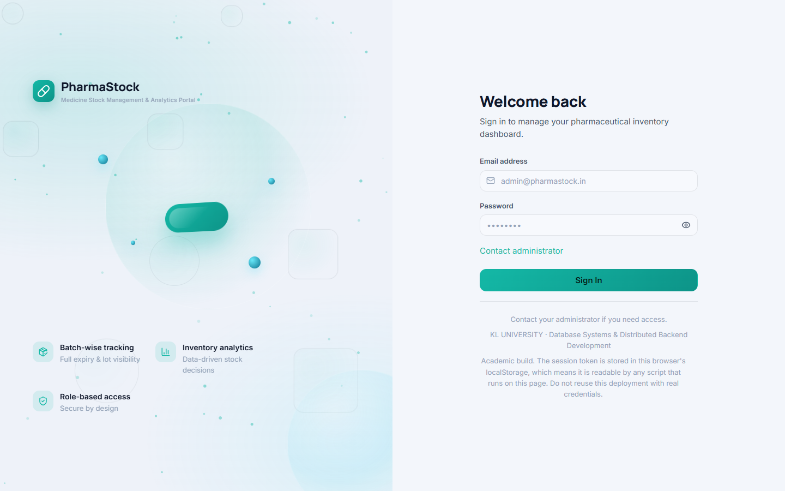 | 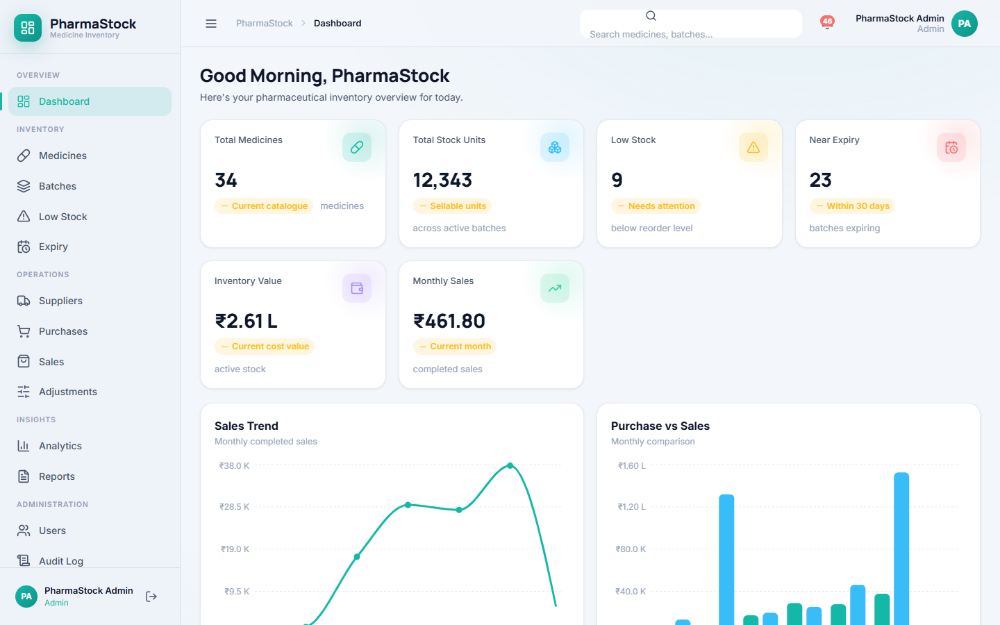 |

| Medicines | Batches |
| --- | --- |
| 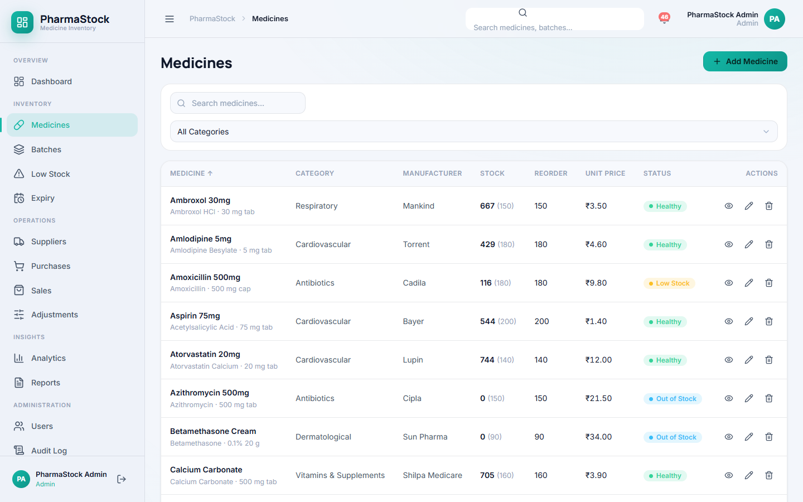 | 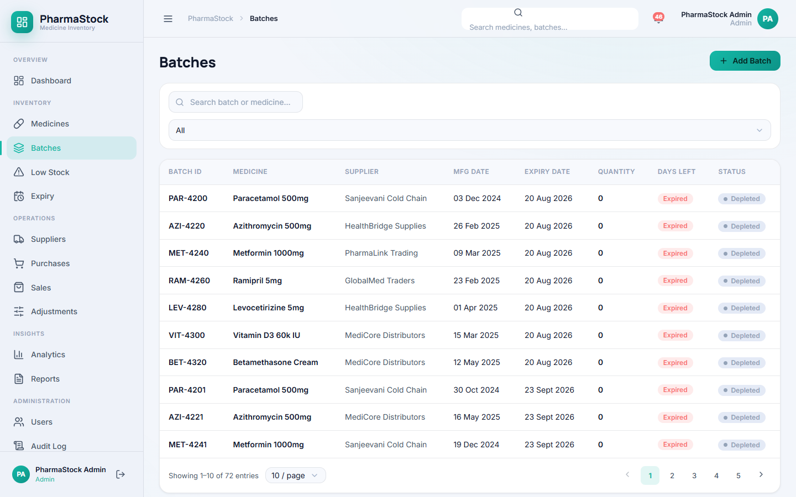 |

| Expiry tracking | Purchases |
| --- | --- |
| 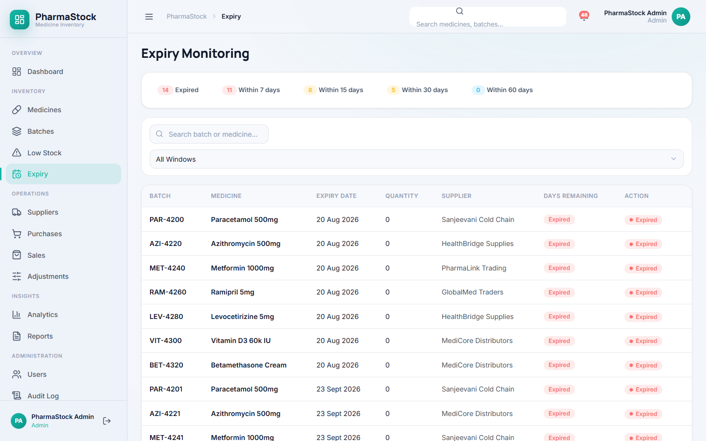 | 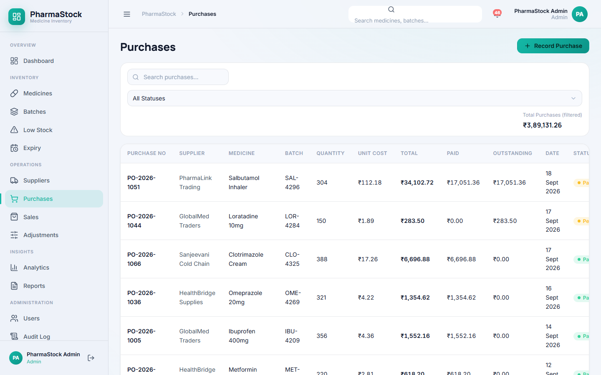 |

| Sales with FEFO allocation | Stock adjustments |
| --- | --- |
| 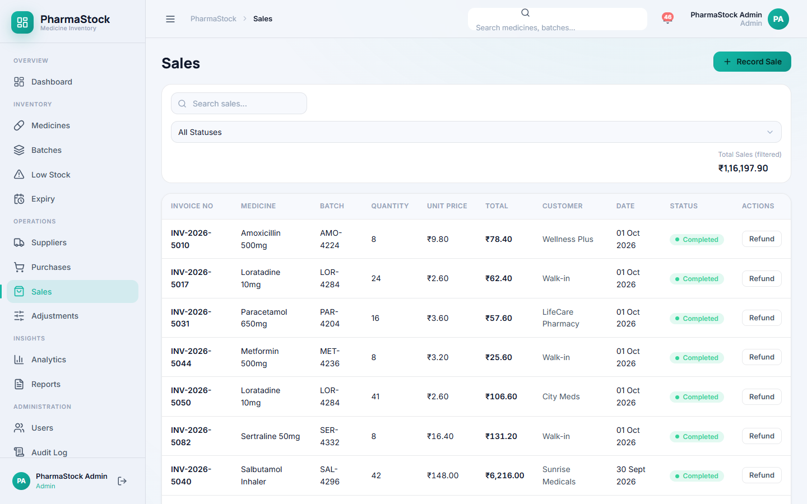 | 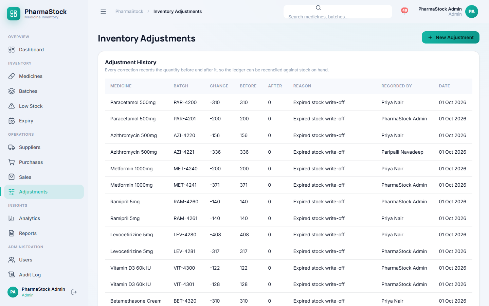 |

| Analytics | Reports |
| --- | --- |
| 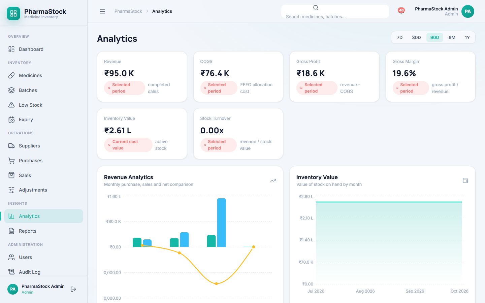 | 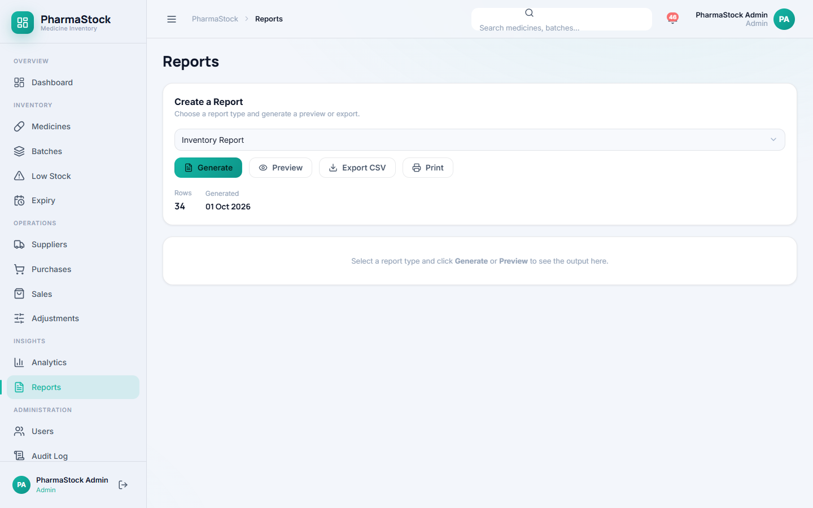 |

| Audit log | Suppliers |
| --- | --- |
| 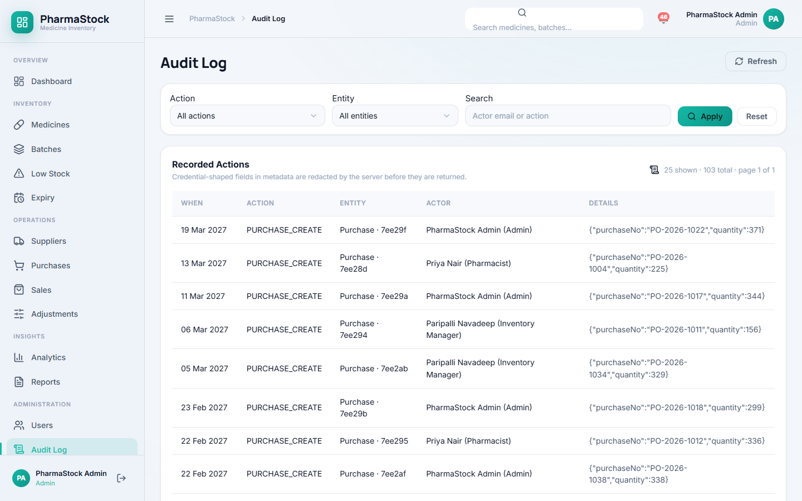 | 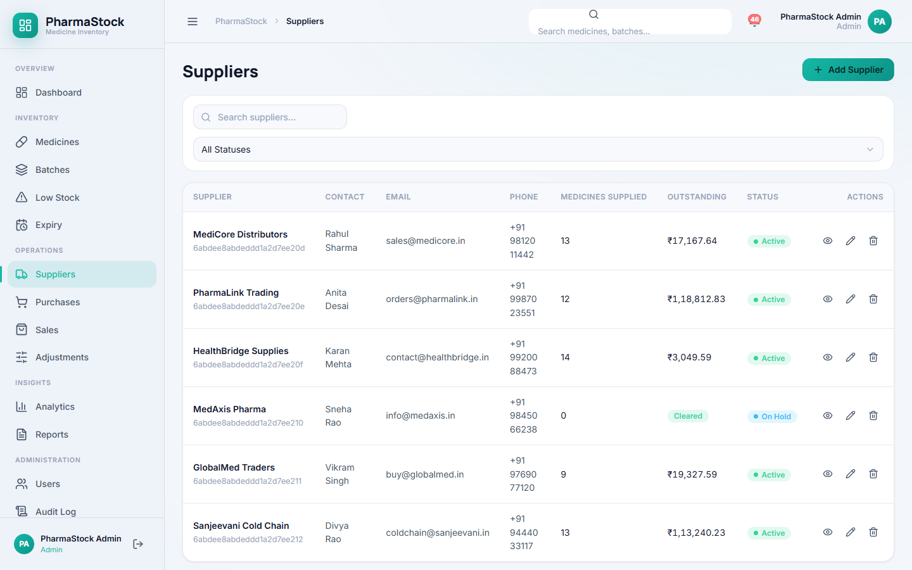 |

| Low stock |
| --- |
| 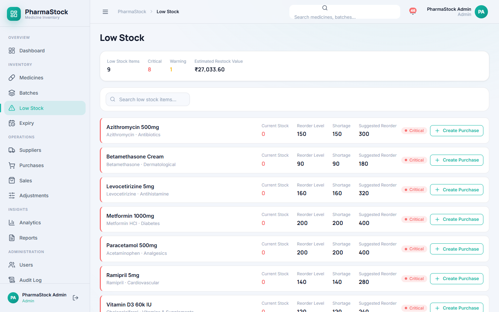 |

## Known limitations

- **JWT in `localStorage`** — vulnerable to XSS; acceptable for a course demo, not for production.
- **Settings are browser-local** — they do not sync across devices or users.
- **No refresh tokens** — a session ends when the JWT expires and the user logs in again.
- **Pagination is offset-based** — list endpoints take `page`/`limit`; the UI pages some tables client-side.
- **Report queries cap at 1000 rows** per request, and CSV export is built client-side from those already-fetched rows.
- **No realtime updates** — data refreshes on navigation and after mutations, not via websockets. The alert badge reloads on navigation for the same reason.
- **No CI secret storage** — CI generates its JWT secret and seed password per run rather than using repository secrets, so a fork's first run works without configuration.
- **No automated accessibility scanner** — accessibility was reviewed statically (label/control association, focus order, dialog semantics) rather than with axe or a screen reader.

## Future improvements

- Move the token to `HttpOnly`/`Secure` cookies and add refresh-token rotation.
- Server-side user settings and per-user notification preferences.
- Barcode/QR scanning for batch intake and sale entry.
- Expiry escalation schedules (30/60/90-day) with email digests.
- Purchase-order workflow with supplier confirmation and goods-receipt matching.
- Lot recall and quarantine workflows.
- Cursor-based pagination for large catalogues.
- Containerized deployment with a managed replica set and TLS.
- Replicate the expiry-risk and low-stock alerts to scheduled email digests.

## Documentation

| Document | Contents |
|---|---|
| [Architecture](Project/docs/ARCHITECTURE.md) | Layering, request flow, module responsibilities |
| [API reference](Project/docs/API.md) | Endpoints, request/response shapes, query parameters, error codes |
| [Security](Project/docs/SECURITY.md) | Auth, RBAC, validation, known limitations |
| [Testing](Project/docs/TESTING.md) | Test layers and how to run them |
| [Database design](Project/docs/DATABASE_DESIGN.md) | Collection design and stock model |
| [Database schema](Project/docs/DATABASE_SCHEMA.md) | Field-level schema reference |
| [Database setup](Project/docs/DATABASE_SETUP.md) | Replica set configuration |
| [Deployment](Project/docs/DEPLOYMENT.md) | Environment and deployment requirements |
| [Abstract](Project/docs/ABSTRACT.md) | Project abstract |
| [Final review report](Project/docs/FINAL_REVIEW_REPORT.md) | Evidence-based hardening report |
| [Final QA evidence](Project/docs/FINAL_REVIEW_QA.md) | Recorded command results |
| [Demo script](Project/docs/FINAL_DEMO_SCRIPT.md) | Faculty review walkthrough |
| [Review-3 guide](Project/docs/REVIEW_3_GUIDE.md) | Design rationale and anticipated viva questions |
---

**Karkala Shiva Reddy** — [GitHub](https://github.com/karkalashivareddy)
